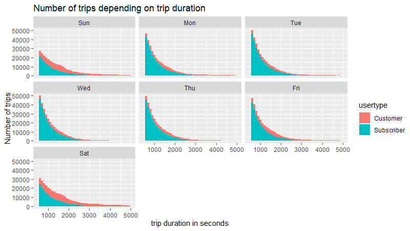
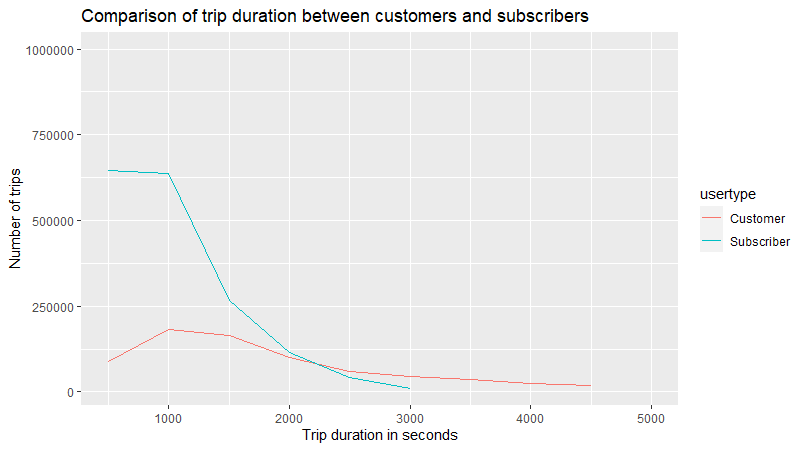

## Business task 


The business task we will examine is the following:

##### *How do annual members and casual riders use Cyclistic services differently?*

## Prepare

Using the data from Cyclistic (Cyclistic is a fictional company the data used comes from Motivate International Inc. under this [licence](https://ride.divvybikes.com/data-license-agreement)).

The data is downloaded and will be treated locally using RStudio.
We will be using data from 2019 because the monthly data from 2021 is incomplete. Furthermore we could suppose measures taken during the pandemic have changed the use patterns in a way that is not representative of long term use. The data is supposed reliable and original for this case study, it is comprehensive and still relatively current.

The data includes:  

 * The duration of each trip  
 * Start and end points  
 * The status of the client: member or casual rider  
 * Their birth year and gender  

This should allow us to compare demographics between member and casual riders, as well as the differences in usage of the service (routes, travel time etc).

## Process

* Tools
For this analysis I have chosen to use Rstudio over spreadsheets because of the large size of the dataset.

I could have used SQL but I believe if we have the possibility to treat the data locally it's better to use it.

Furthermore I would like to sharpen my R skills.

* Data integrity 

First I loaded each csv file:


``` {r, eval=F, echo=T}
library(readr)
library(dplyr)
library(tidyr)
library(janitor)

Quarter_1_trips <- read.csv(file='Divvy_Trips_2019_Q1.csv')
#I have a look at it
str(Quarter_1_trips)
View(Quarter_1_trips)

#loading each quarterly file and checking for data integrity
Quarter_2_trips <- read.csv(file='Divvy_Trips_2019_Q2.csv')
#I have a look at it
str(Quarter_2_trips)
View(Quarter_2_trips)
```  

Here we realized the column names for Q2 are inconsistent with the rest of the data set, so we decided to change them using the following:
```{r, eval=FALSE, echo=TRUE}
#list Q1 variable names
ls(Quarter_1_trips)

#replace the bad column names with the ones consistent with the rest of the dataset.
names(Quarter_2_trips) <- c("trip_id", "start_time","end_time", "bikeid","tripduration","from_station_id","from_station_name","to_station_id","to_station_name","usertype","gender","birthyear")
View(Quarter_2_trips)
```

After correcting the column names we can merge all the data frames together:
```{r, eval=F, echo= T}
Semester_1 <- full_join(Quarter_1_trips, Quarter_2_trips)
glimpse(Semester_1)

Semester_2<- full_join(Quarter_3_trips,Quarter_4_trips)
glimpse(Semester_2)
 
Yearly_trips <- full_join(Semester_1,Semester_2)
glimpse(Yearly_trips)
```
We can start checking for duplicates or empty cells.
```{r, eval= F, echo=TRUE}
Yearly_trips %>%  get_dupes(trip_id)
```

Then we added a column with the day of the week calculated using `start_time` and `wday()`.  

```{r, eval= F, echo=TRUE}

# create a temp frame for dates
library(lubridate)
date_trips <- Yearly_trips %>%  select(trip_id, start_time)
View(date_trips)

View(date_trips)
#join date_trips and Yearly_trips to populate day_of_week
Yearly_trips_day <- left_join(Yearly_trips, date_trips)
glimpse(Yearly_trips_day)


```

## Analysis 

First we can separate different types of customers to compare them.    

```{r, eval= F, echo=TRUE}

# Create casual table 
Yearly_casuals <-  filter(Yearly_clean, usertype == "Customer")
glimpse(Yearly_casuals)

#Create suscriber/ member table
Yearly_members <-  filter(Yearly_clean, usertype == "Subscriber")

#compare total and casual trips
nrow(Yearly_members) *100/ nrow(Yearly_clean)
nrow(Yearly_casuals) *100/ nrow(Yearly_clean)

```  
Here we can clearly see that members represent the vast majority of trips taken with 76.9 % of total trips while casual trips represent only 23% of total trips.

Using ```Summarize``` we can see that the mean trip duration for casual users is 3421 seconds ( around 57 minutes). 

On the other hand the mean trip duration for members is 859 seconds (around 14 minutes).

## Visualization

```{r, eval= F, echo=TRUE}
ggplot(Yearly_clean, aes(tripduration, fill= usertype)) + 
  facet_wrap(~dow)+
  geom_histogram(binwidth = 100)+
  xlim(500,5000)+
  xlab("trip duration in seconds")+
  ylab("Number of trips")+
  labs(title="Number of trip by trip duration")
```  
  


Here we can clearly see that trips made by casual users represent a bigger percentage of the total amount of trips on Saturdays and Sundays. 
```{r, eval= F, echo=TRUE}
ggplot(Yearly_clean, aes(tripduration)) + 
  geom_freqpoly(aes(colour = usertype), binwidth =500, na.rm = TRUE) +
  xlim(500, 5000)+
  ylim(10000, 1000000)+
  xlab("Trip duration in seconds")+
  ylab("Number of trips")+
  labs(title = "Comparison of usage between customers and suscribers")
```  
  

Looking at this graph we can also see a different in usage of the service, while the vast majority of subscribers use the services for trips shorter than 1000 seconds (around 16 minutes), customers tend to use the service for slightly longer trips (between 1000 and 1500 seconds).  

The sharp decline in the number of trips longer than 1000 second in the subscribers curve is not matched in the customer curve where the decline of number of trips compared to a longer trip duration is less sharp.

## Act

As we saw, current Customers and Suscribers have very different usage of the services.  
While Subscribers tend to use the services more during week days and for shorter trips of less than 15 minutes; casual customers tend to use the services more on weekends and for longer trips. 

One solution would be to create incentives for casual users to use the service more for short trips and thus create a habit of using the services not only for leisure rides but also as a mean of transportation.

Another solution would be to create add campaigns targeting casual users in their current usage of the services and showing them the value of subscription even for repeated leisure use.


