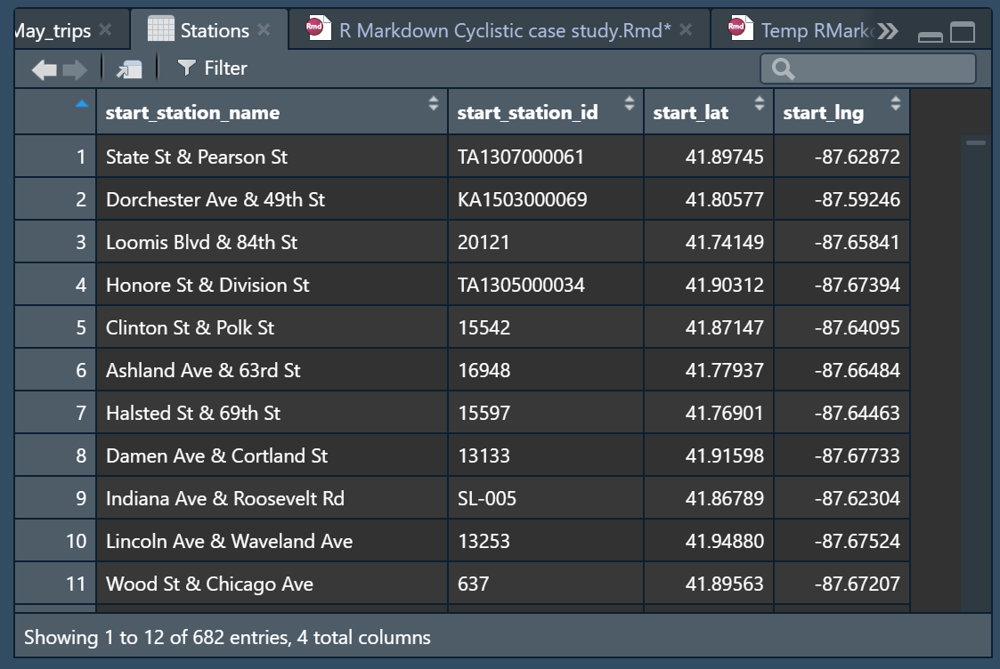

## Business task 

The business task we will examine is the following:

##### *How do annual members and casual riders use Cyclistic services differently?*

## Prepare

Using the data from Cyclistic (Cyclistic is a fictional company the data used comes from Motivate International Inc. under this [licence](https://ride.divvybikes.com/data-license-agreement)).

The data is downloaded and will be treated locally using RStudio.
We will be using data from 2021. The data is supposed reliable and original for this case study, it is comprehensive and current.

## Process

* Tools
For this analysis I have chosen to use Rstudio over spreadsheets because of the large size of the dataset.

I could have used SQL but I believe if we have the possibility to treat the data locally it's better to use it.

Furthermore I would like to sharpen my R skills.

* Data integrity 

First I loaded part of the data set using 
` January_trips <- read.csv(file='202101-divvy-tripdata.csv')`

Then I get an idea of the dataset using  ` head(January_trips)  
View(January_trips) `

I repeat this process for each month and check for data integrity.   

`February_trips <- read.csv(file='202102-divvy-tripdata.csv')
View(February_trips)`  

`March_trips <- read.csv(file='202103-divvy-tripdata.csv')
View(March_trips)`  

`April_trips <- read.csv(file='202104-divvy-tripdata.csv')
View(April_trips)`   
  
  `May_trips <- read.csv(file='202105-divvy-tripdata.csv')
View(May_trips)`  

Here we can see the this file is incomplete.
We are missing the data points for start_station_name, start_station_id, end_station_name, end_station_id.  

Fortunately we can populate these data points using start_lat and start_long values and end_lat end_long and associating lat and long values with stations.

*Let's do that now*  
  
  We start by defining what are the stations on the network:

`Stations <- April_trips %>% 
  distinct(start_station_name, start_lng, start_lat,start_station_id)`  
  
   a few rows are empty in start_station_name we can just drop them  
       
`Stations <-  Stations %>%  distinct(start_station_name,.keep_all = TRUE)
View(Stations)`

we get this beautiful dataframe:
  
So we have 682 stations on the network, cool and now we have their matching ID and lat/lng.

However despite searching for a very long time trying to use fill() or some kind of join. I can't figure out how to populate the cells in May_trips.  
     
  
  
  Pls send help

